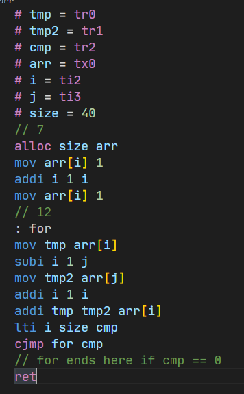

# jpp-language README

Add support for the jpp programming language.
Files ending with .jpp or .gc or .gvm are deceted as such.

## Features

jpp, a fast interpreted language using the jpp interpreter made by [DeveloperX19](https://github.com/DeveloperX19).

> Tip: Many popular extensions utilize animations. This is an excellent way to show off your extension! We recommend short, focused animations that are easy to follow.

## Requirements

You need the jpp interpreter. Currently in development.
Will be availabe soon.

## Known Issues

Idk

## Release Notes

### 0.0.1

Initial release of jpp-language vs code extension

---
